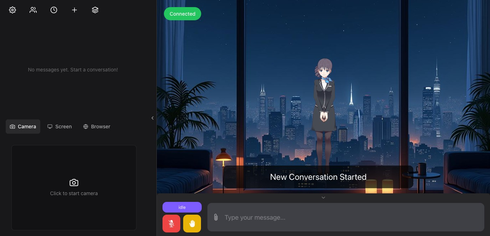
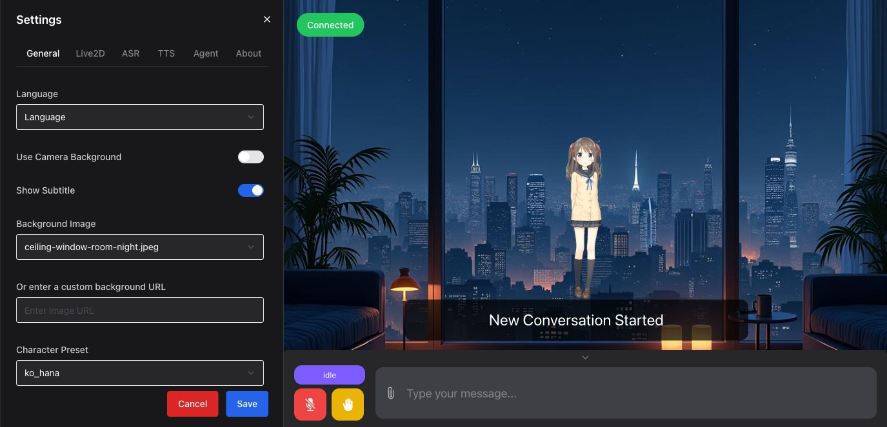

# llm_vtuber

한국어 음성 대화형 AI VTuber. [Open-LLM-VTuber](https://github.com/Open-LLM-VTuber/Open-LLM-VTuber) v1.2.1을 기반으로
한국어 지원, 무료 Live2D 모델·음성 스위칭, 화면 조작·화면 분석(컴퓨터 사용) 기능을 얹은 개인 프로젝트입니다.
업스트림 문서는 [README.upstream.md](README.upstream.md) 참고.



## 주요 기능

| 기능 | 구현 |
|------|------|
| 🇰🇷 한국어 대화 | sherpa-onnx SenseVoice ASR(한국어 인식, 오프라인) + 한국어 페르소나 + edge-tts 한국어 음성 |
| 🎙️ 음성 대화 | 브라우저 마이크 입력(Silero VAD) → ASR → LLM → TTS 음성 출력. 발화 중 끼어들기 지원 |
| 👧 캐릭터 5종 스위칭 | 무료(공식 샘플) 여성 Live2D 모델 — 설정 → Character Preset 클릭 한 번으로 모델+음성+성격 전환 |
| 🔊 무료 음성 5종 | 캐릭터마다 다른 무료 edge-tts 음성 (SunHi / Ava / Emma / Seraphina / Vivienne) |
| 🖱️ 화면 조작 | "○○ 클릭해줘" → OCR로 화면 텍스트 좌표를 찾아 마우스 클릭·키 입력·타이핑·스크롤 수행 |
| 👀 화면 분석 | 스크린샷 → 로컬 비전 모델(gemma3)이 틀린 부분을 짚고 정답 설명. 비전 모델 불능 시 OCR 폴백 |

## 캐릭터

| 프리셋 | 모델 | 음성 (edge-tts, 무료) | 성격 |
|--------|------|------|------|
| `ko_yuna` (기본) | Haru | ko-KR-SunHiNeural | 만능 비서 — 화면 조작 담당 |
| `ko_hana` | Hiyori | en-US-AvaMultilingualNeural | 발랄한 게이머 친구 |
| `ko_sora` | Rice | en-US-EmmaMultilingualNeural | 과외 선생님 — 화면 공유로 오답 짚기 |
| `ko_rin` | Ren | de-DE-SeraphinaMultilingualNeural | 시크한 시니어 개발자 |
| `ko_mao` | mao_pro | fr-FR-VivienneMultilingualNeural | 장난꾸러기 고양이 마녀 |

모델 출처·라이선스: [live2d-models/MODELS.md](live2d-models/MODELS.md) (Live2D 공식 무료 샘플, Free Material License)



## 빠른 시작

```bash
# 0. 사전 준비: uv, ollama
ollama pull qwen3:4b    # 대화 + 도구 호출
ollama pull gemma3:4b   # 화면 분석(비전)

# 1. 설치
git clone --recursive https://github.com/leeminsuk/llm_vtuber
cd llm_vtuber
uv sync

# 2. 설정 (한국어 기본값 템플릿 복사)
cp config_templates/conf.KO.default.yaml conf.yaml

# 3. 실행
uv run run_server.py
# → http://localhost:12393 접속, 마이크 버튼 누르고 말하면 됨
```

### macOS 권한 (화면 조작/분석 사용 시 1회)

시스템 설정 → 개인정보 보호 및 보안에서 **서버를 실행하는 터미널 앱**에 부여:

- **손쉬운 사용(Accessibility)**: 마우스·키보드 제어
- **화면 기록(Screen Recording)**: 스크린샷·OCR (미부여 시 검은 화면이 캡처됨)

긴급 중단: 마우스를 화면 모서리로 강하게 이동하면 pyautogui FAILSAFE가 작동해 조작이 중단됩니다.

## 화면 조작·분석 동작 방식

`mcp_servers/computer_control.py` (MCP 서버, 도구 9종)가 에이전트에 연결됩니다.

- 클릭 좌표는 LLM이 추측하지 않습니다 — macOS Vision OCR(한/영)이 화면 텍스트의
  실제 좌표를 계산해 주고(`find_text_on_screen`), 클릭은 그 좌표로만 수행합니다.
- `analyze_screen`은 스크린샷을 로컬 ollama 비전 모델(`OLLAMA_VISION_MODEL`, 기본 gemma3:4b)에
  보내 "내가 뭘 틀렸는지" 판단·설명을 받습니다. 비전 모델이 죽어 있으면 OCR 텍스트로 폴백합니다.
- 예: *"화면에서 저장 버튼 눌러줘"*, *"내 수학 풀이 봐줘. 틀린 데 있어?"* (ko_sora 추천)

## 테스트

```bash
uv run pytest tests/   # 모델 사전 무결성 · 캐릭터 전환 검증 · MCP 도구 검색 · OCR 파이프라인
```

## 라이선스

- 코드: MIT (업스트림 Open-LLM-VTuber 라이선스 승계, [LICENSE](LICENSE))
- Live2D 샘플 모델: © Live2D Inc., [Free Material License](LICENSE-Live2D.md)
